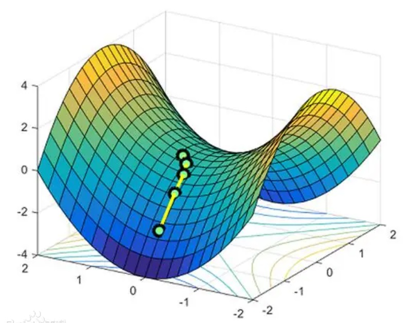
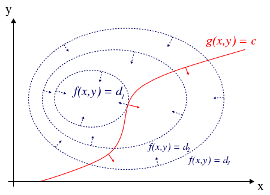

# 鞍点

# 证明
## 对二维情况做证明

对于$f(x,y)$和$h(x,y)$，设对于$f$，在$A$点有极值，则有
$$\begin{aligned}
		 df=\frac{\partial f}{\partial x}dx+\frac{\partial f}{\partial y}dy=0 \\d g=\frac{\partial g}{\partial x}dx+\frac{\partial g}{\partial y}dy=0 \end{aligned}$$
解得$\frac{\frac{\partial f}{\partial x}}{\frac{\partial g}{\partial x}}=\frac{\frac{\partial f}{\partial y}}{\frac{\partial g}{\partial y}}=-\lambda$.
根据上式可以推出
$$\begin{aligned} \frac{\partial f}{\partial x}+\lambda \frac{\partial g}{\partial x}=0\\\frac{\partial f}{\partial y}+\lambda \frac{\partial g}{\partial y}=0 \end{aligned}$$
上下分别乘$dx$和$dy$，再积分，即得到了$\mathcal{L}(x,y,\lambda)=f(x,y)+\lambda\cdot g(x,y)$
求原函数极值问题就转成了求$\mathcal{L}$极值的问题